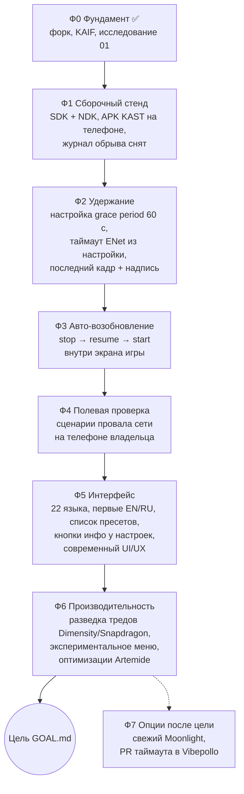

# KAST — MASTER PLAN

> Дорожная карта: как проект идёт от **текущего состояния** к видению из `GOAL.md`. Крупные фазы и вехи;
> пошаговые планы живут в `plans/`. Выведен из `GOAL.md` агентом при развёртывании 2026-09-26 и обновляется
> навыком `/revision`, когда меняется цель или состояние.
>
> Это **живой справочник**, а не задача — тегом `DONE` не помечается.

---

## Видение (одной строкой)

KAST на медленном или пропадающем интернете ждёт сеть до 60 секунд и сам восстанавливает поток, сохраняя
игровую сессию; KAST говорит на всех 22 языках Artemis (первые — EN и RU) и выглядит современно.

## Руководящие принципы

- **Наблюдение прежде правки.** Каждое изменение поведения сети сначала воспроизводится на телефоне
  владельца и снимается журналом (logcat клиента + журнал Vibepollo); причина и итог проверяются по журналу.
- **Настоящее завершение неприкосновенно.** Пакет завершения от сервера, выход пользователя и «выйти из
  игры» работают как в Artemis — без ожидания.
- **Маленький дифф к Artemis.** KAST остаётся форком: каждое изменение локально и объяснимо, чтобы свежие
  версии Artemis и Moonlight вливались без боли.
- **Одно решение — одно место** (`AGENT_GUIDE.md` → Architecture): ядро решает «транспорт умер», `Game`
  решает «ждать, возобновлять или закрывать».
- **Каждая новая строка интерфейса — сразу на EN и RU и в переводе на все 22 языка выбора**
  (`ideas/03_localization_en_ru.md`).

## Путь — фазы

### Ф0 — Фундамент
- **Цель фазы:** проект KAST существует и готов к работе.
- **Шаги:** публичный форк Artemis `MikalaiKryvusha/KAST`; KAIF развёрнут; причины обрыва найдены и записаны —
  `researches/01_why_session_drops_on_network_loss.md`.
- **Статус:** ✅ 2026-09-26.

### Ф1 — Сборочный стенд
- **Цель фазы:** агент собирает APK KAST на компьютере владельца, ставит его на телефон и снимает журнал
  обрыва до правок (эталон «как было»).
- **Шаги:** установить Android SDK (`compileSdk 36`) и NDK `27.0.12077973`; собрать
  `gradlew.bat :app:assembleNonRoot_gameDebug`; дать приложению своё имя и `applicationId`, чтобы KAST стоял
  на телефоне рядом с Artemis/Artemide; воспроизвести обрыв (режим полёта на 15 с) и снять logcat.
- **Статус:** 🔲.

### Ф2 — Удержание
- **Цель фазы:** короткий провал сети (пока сервер держит клиента) проходит без разрыва сессии.
- **Шаги:** политика ожидания переподключения отдельными опциями в `PreferenceConfiguration` — время ожидания
  «reconnect grace period» (по умолчанию 60 с) и частота повторных попыток (`ideas/01`, требование 4); таймаут ENet на
  клиенте берётся из настройки (сейчас он жёстко равен 10 с, `ControlStream.c:1802`) — для этого нужен свой
  форк `moonlight-common-c`; на время провала — последний кадр и надпись с отсчётом; журнал причин.
- **Статус:** 🔲.

### Ф3 — Авто-возобновление
- **Цель фазы:** когда транспорт всё-таки умер (сервер отпустил клиента через 5–30 с, сменился IP), KAST сам
  делает `stop → resume → start` и остаётся на экране игры.
- **Шаги:** в `Game.connectionTerminated` — ветка «транспортная смерть в пределах grace period»; снимок кадра
  поверх поверхности; ожидание сети (`ConnectivityManager.NetworkCallback`); новая попытка через `NvConnection`
  (`startApp` сам выберет `resume`); отступ между попытками; по истечении периода — прежний диалог.
- **Статус:** 🔲.

### Ф4 — Полевая проверка
- **Цель фазы:** все признаки успеха из `GOAL.md` наблюдаются на телефоне владельца.
- **Шаги:** сценарии — провал 5 / 20 / 45 / 70 с; смена Wi-Fi ↔ LTE; завершение сессии сервером; выход
  пользователем. Для каждого — журнал клиента и сервера в отчёте.
- **Статус:** 🔲.

### Ф5 — Интерфейс
- **Цель фазы:** KAST говорит на всех 22 языках (первые — EN и RU), список пресетов управляется гибко, у каждой настройки есть пояснение,
  интерфейс выглядит современно.
- **Шаги:** полные качественные переводы всех 22 языков (сейчас полных нет; у большинства 20–40 % строк) и три
  способа выбора языка — системный, настройки KAST, настройки ОС — с проверкой конфликта `default` (`ideas/03`); перемещение пресетов
  выше и ниже и отдельное удаление (`ideas/05`); кнопка [i] с модальным пояснением у каждого из ~124 пунктов
  настроек (`ideas/06`); освежение экранов по образцам владельца, снимки до и после (`ideas/04`).
- **Статус:** 🔲; открытые вопросы владельцу — в идеях 04 и 05.

### Ф6 — Производительность
- **Цель фазы:** отдельное экспериментальное меню в настройках KAST включает оптимизации под чипы MediaTek
  Dimensity и Snapdragon; каждая включённая оптимизация даёт измеримый выигрыш на телефоне владельца.
- **Шаги:** разведка тредов сообщества по чипам — `researches/02_*` (оптимизация · источник · чип · заявленный
  эффект); экспериментальное меню, каждая оптимизация — свой переключатель, по умолчанию выключен; перенос
  31 оптимизации Artemide и оптимизаций из разведки по одной, с замером до и после (`ideas/02`).
- **Статус:** 🔲; идея одобрена владельцем 2026-09-26.

### Ф7 — Опции после цели (каждая — по решению владельца)
- Влить свежую волну Moonlight (12.2: NDK r29, API 36, геймпады — 55 коммитов, которых нет в Artemis).
- PR в Vibepollo: настраиваемый таймаут ENet-пира на сервере — тогда удержание переживёт и длинный провал без
  возобновления.

## Журнал решений

| Отметка | Решение | Почему |
|------|----------|-----|
| 2026-09-26 ≈09:45 +03:00 | Основа форка — Artemis (`ClassicOldSong/moonlight-android`) | слово владельца: «берем тот мобильный клиент, который активно развивают»; мобильный форк Nonary заброшен с 2022 |
| 2026-09-26 ≈09:45 +03:00 | Имя — KAST (KRINIK Artemis Streaming Tool), репозиторий публичный | слово владельца в чате |
| 2026-09-26 ≈09:50 +03:00 | KAIF — сборка HEAD `83400e6` проекта KAIF (содержимое 2.8, штамп 2.7 до выпуска 2.8) | слово владельца «kaif разворачиваем 2.8»; штамп версии ставит только ритуал выпуска KAIF, после выпуска — `/kaif-update` |
| 2026-09-26 ≈10:00 +03:00 | Решение о переподключении — два слоя: удержание + авто-возобновление | сервер Vibepollo отпускает клиента по умолчаниям ENet (5–30 с), `researches/01` |
| 2026-09-26 (≈, после 10:05 +03:00) | Оптимизации Artemide и сообщества — в отдельное экспериментальное меню (фаза Ф6) | слово владельца: «Нужно отдельное эксперементальное меню в настройках с включением этих оптимизаций» |

---

> **Сопровождение:** держи документ в согласии с реальностью. Когда `GOAL.md` или состояние проекта заметно
> меняются, запускай `/revision`. Пошаговые планы фаз — в `plans/`.
