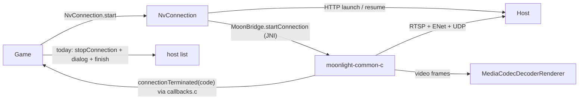

# KAST — Internal architecture map

> **The INTERNAL map: how the system thinks** — the abstractions of a Moonlight-protocol streaming client and
> how they interact. File placement lives in `PROJECT_STRUCTURE_EXTERNAL_MAP.md`.
> **Living reference — never DONE-tagged.**

---

## The core abstractions

| Abstraction | What it *is* (essence) | Responsibility |
|-------------|------------------------|----------------|
| Host (server) | Vibepollo / Apollo / Sunshine on the owner's PC | HTTPS API (pair, applist, launch, **resume**, quit) + RTSP + ENet control + UDP video/audio |
| Session | one streaming run of one app on the host | lives on the host; survives a client disconnect as "paused, awaiting /resume" (Vibepollo) |
| Connection | one client-side transport instance of a session (`LiStartConnection` … `LiStopConnection`) | RTSP handshake, then the ENet control stream + UDP video/audio/input; dies as a whole |
| Control stream (ENet) | reliable UDP channel to the host | keep-alive pings, input, IDR requests, loss stats, server termination notice; **its peer timeout decides "the host is dead"** (client 10 s, `ControlStream.c:1802`; server = ENet defaults 5–30 s) |
| Termination callback | `connectionTerminated(code)` — fired once per connection (`Connection.c:158`) | carries the reason code: 0 graceful, −100…−104 known, −1 / errno for transport death |
| Game (Activity) | the stream screen | owns the surface + decoder; today maps ANY non-zero termination to "dialog + finish" |
| Decoder/renderer | `MediaCodecDecoderRenderer` on the `SurfaceView` | the last decoded frame stays on the surface until the surface or decoder is torn down |

## How they interact

## Invariants & rules of the model

- One connection = one termination callback. After it fires, the connection is unusable; recovery means a NEW
  connection (stop → resume → start), never "reviving" the old one.
- Server-initiated termination (termination packet, `ControlStream.c:1310–1373`) is final and must stay immediate.
- All UDP sockets bind to the local address of the RTSP connection (`LocalAddr`) — a changed phone IP kills the
  transport for good; over Tailscale the `100.x` address is stable and the old sockets recover.
- Decide "transport dead" in the core, decide "tear down vs. reconnect" in `Game` — one owner per decision.

## Key decisions embedded in the architecture

- Upstream Moonlight treats every transport death as terminal (no reconnect) — the whole reconnect story is
  KAST's addition (`GOAL.md`, `researches/01`). The decisions for it go to `MASTER_PLAN.md` → Decision log.

---

> Keep this in sync with the real logic as it evolves. When you introduce or retire an abstraction, or
> change how they interact, update this map in the same change.
