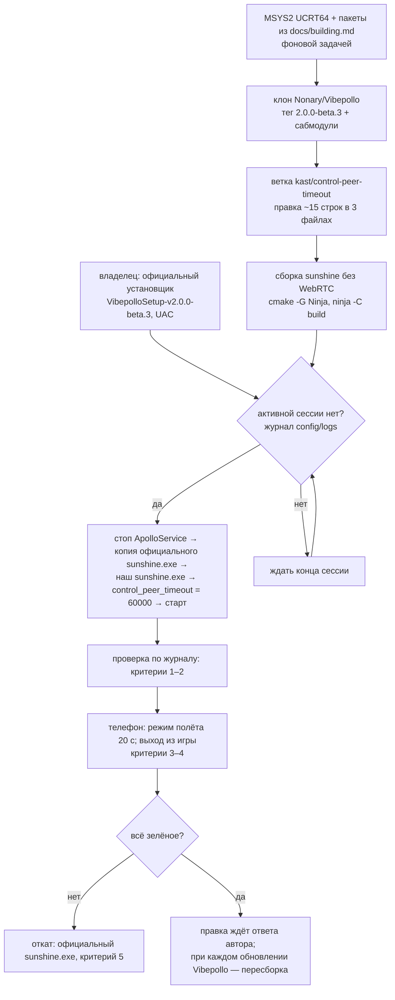

# План 01 — локальная правка Vibepollo: настраиваемый таймаут управляющего канала

> **Создан:** 2026-09-26 (агент, по слову владельца: «локально обновляем вайбполо и делаем локальные правки, как
> нам нужно под реконект» · «минимальные правки делаем, ждем от автора вайбполо отклика на нашу просьбу»)
> · **Родитель:** `ideas/01_reconnect_grace_period.md`, `researches/01_why_session_drops_on_network_loss.md`
> · **Статус:** 🔲 план написан 2026-09-26; шаги не начаты · **Вовне:** запрос автору Vibepollo (issue) — текст
> ждёт слова владельца; готовая правка — автору как PR, если он захочет

## Вектор цели

Сервер Vibepollo на компьютере владельца держит сессию, пока клиент молчит до 60 секунд: управляющий канал ENet
не отпускает клиента через 5–30 секунд по умолчаниям ENet. Правка минимальная (около 15 строк), живёт локально,
пока автор Vibepollo не ответит на запрос; по умолчанию поведение сервера не меняется.

## Критерии приёмки

| # | Критерий | Шкала | Измеритель | Цель |
|---|---|---|---|---|
| 1 | Vibepollo обновлён до официального выпуска | версия в журнале | строка `Vibepollo version:` в новом журнале `config\logs\` | `2.0.0-beta.3` |
| 2 | Правка стоит и включена | строки журнала | `config: 'control_peer_timeout' = 60000` при старте службы и строка правки при подключении клиента | обе строки есть |
| 3 | Сервер держит молчащего клиента | секунды от начала обрыва до конца сессии | отметки журнала сервера при режиме полёта на телефоне 20 с | ≥ 55 с (раньше 5–30 с) |
| 4 | Штатное завершение не сломано | поведение | выход из игры в клиенте → `CLIENT DISCONNECTED` в журнале | сразу, как до правки |
| 5 | Откат работает | действие | подмена `sunshine.exe` на официальный файл из копии и перезапуск службы | служба стартует |

Критерий 3 на нынешнем клиенте Artemide наблюдается частично: клиент сам сдаётся через 10 с. Полная проверка —
вместе с KAST (`MASTER_PLAN.md` → Ф2).

## Схема

## Правка (тег `2.0.0-beta.3`)

1. `src/config.h:272` — рядом с `ping_timeout` поле `std::chrono::milliseconds control_peer_timeout;`.
2. `src/config.cpp:983` — значение по умолчанию `0ms` (0 = умолчания ENet, поведение не меняется);
   `src/config.cpp:2136` — чтение `control_peer_timeout` из `sunshine.conf` тем же способом, что `ping_timeout`.
3. `src/stream.cpp:1061` (`case ENET_EVENT_TYPE_CONNECT`) — если значение больше 0:
   `enet_peer_timeout(event.peer, ENET_PEER_TIMEOUT_LIMIT, t, t)` и строка журнала с числом.

`ping_timeout = 60000` у владельца уже стоит и закрывает молчание клиента до 60 секунд: `pingTimeout` сессии
обновляется на каждом событии ENet (`stream.cpp:1041`).

## Шаги

- [ ] 1. Поставить MSYS2 (`winget install MSYS2.MSYS2`) и пакеты UCRT64 из `docs/building.md` — фоновой задачей.
- [ ] 2. Клонировать `Nonary/Vibepollo` с сабмодулями в `D:\work\ai_sandbox\Vibepollo`, тег `2.0.0-beta.3`,
      ветка `kast/control-peer-timeout`.
- [ ] 3. Внести правку; `git diff --stat` — 3 файла, около 15 строк.
- [ ] 4. Собрать: `cmake -B build -G Ninja -S . -DSUNSHINE_ENABLE_WEBRTC=OFF` → `ninja -C build` — фоновой задачей.
- [ ] 5. Владелец ставит официальный `VibepolloSetup-v2.0.0-beta.3.exe` (окно UAC — его клик); проверка критерия 1.
- [ ] 6. Подмена по схеме, только без активной сессии; копия официального файла —
      `C:\Program Files\Apollo\sunshine.exe.official-2.0.0-beta.3`.
- [ ] 7. Проверка критериев 2–5; отчёт с журналами — `reports/`.

## Риски

- **Веб-клиент в браузере (WebRTC) в нашей сборке не работает:** WebRTC собирается отдельно и тяжело, наша
  сборка без него. ❓ Владелец пользуется браузерным клиентом Vibepollo?
- **Каждое обновление Vibepollo затирает наш `sunshine.exe`** — до ответа автора правка пересобирается на
  каждый новый выпуск.
- **Перезапуск службы обрывает живую трансляцию** — перед шагом 6 журнал проверяется на активную сессию.
- **Несовпадение с библиотеками установщика** (`vibeshine_truehdr.dll`, плагины): официальная сборка тоже идёт
  через MSYS2 UCRT64; проверка — старт службы и журнал; при сбое — откат (критерий 5).
- **Место на диске:** MSYS2 и дерево сборки — несколько гигабайт.
