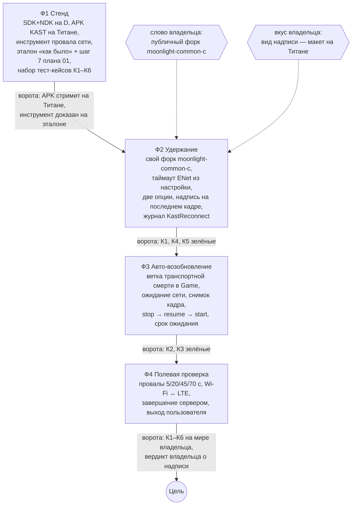

# План 02 — эпик «переподключение»: KAST ждёт сеть до 60 секунд и сам восстанавливает поток

> **Создан:** 2026-09-26 (агент, `/plan-epic`, по слову владельца «принимаемся за разработку KAST … сначала
> планирование, потом по планам работы») · **Родитель:** `ideas/01_reconnect_grace_period.md`, `MASTER_PLAN.md` Ф1–Ф4,
> исследование `researches/02_reconnect_epic_research.md` · **Статус:** 🔧 мета-план 2026-09-26; Ф1 ✅ 2026-09-26
> (`plans/03_epic02_F1_build_stand.md`, судья: VERIFIED WITH CAVEATS); Ф2 — план `plans/04_epic02_F2_hold.md`, развилка
> ядра — `interviews/interview_001_core_fork.md` · **Вовне:** публичный форк `moonlight-common-c` на GitHub владельца — по его
> слову, до кода Ф2

## Вектор цели

- **Достичь:** провал сети до 60 секунд не завершает игровую сессию; пока сети нет, на экране последний кадр; когда
  сеть вернулась, KAST сам восстанавливает поток, не выбрасывая на список хостов.
- **Сохранить:** настоящее завершение сессии сервером и выход пользователя работают как в Artemis — сразу, без ожидания.
- **Избежать:** диалога «Error code -1» и возврата на список хостов при провале короче времени ожидания.

## Критерии приёмки

Каждый критерий — сценарий; проверка идёт на планшете Titan 1 владельца и на его сервере Vibepollo. Строки журнала
клиента несут метку `KastReconnect` (вводится в Ф2).

**К1. Короткий провал — удержание.**
- Ситуация. KAST на Титане показывает рабочий стол компьютера через Tailscale; время ожидания — 60 с.
- Действие. Связь между сервером и Титаном пропадает на 20 с.
- Результат. Всё это время на экране последний кадр и надпись об ожидании; не позже чем через 5 с после возврата связи
  картинка снова движется; список хостов не появлялся.
- Проверка. В журнале сервера за время провала `grep -c "CLIENT DISCONNECTED"` даёт `0`; `adb logcat -d -s KastReconnect`
  содержит `outcome=held` с `elapsed` от 20 до 25 с.

**К2. Длинный провал — авто-возобновление.**
- Ситуация. KAST на Титане показывает рабочий стол компьютера через Tailscale; время ожидания — 60 с.
- Действие. Связь пропадает на 45 с (сервер за это время отпускает клиента).
- Результат. KAST остаётся на экране игры, не позже чем через 10 с после возврата связи поток идёт снова, игра на
  компьютере продолжается с того же места.
- Проверка. Журнал сервера после провала содержит `Session resuming for app`; `adb logcat -d -s KastReconnect` содержит
  `outcome=resumed`.

**К3. Провал дольше времени ожидания.**
- Ситуация. KAST на Титане показывает рабочий стол компьютера через Tailscale; время ожидания — 60 с.
- Действие. Связь пропадает на 70 с.
- Результат. Через 60 с после начала провала KAST показывает прежний диалог завершения с причиной и уходит на список хостов.
- Проверка. `adb logcat -d -s KastReconnect` содержит `outcome=gave-up` с `elapsed` от 60 до 62 с.

**К4. Завершение сервером — как раньше.**
- Ситуация. KAST на Титане показывает рабочий стол компьютера; время ожидания — 60 с.
- Действие. Сессию завершают на сервере (выход из приложения).
- Результат. KAST закрывает экран игры сразу, без надписи об ожидании.
- Проверка. Между строкой завершения в журнале сервера и `connectionTerminated` в logcat — меньше 2 с; строк
  `KastReconnect ... hold start` нет.

**К5. Политика ожидания — две отдельные опции.**
- Ситуация. Экран «Настройки» KAST, время ожидания и интервал повторов — значения по умолчанию.
- Действие. Владелец открывает раздел настроек подключения.
- Результат. Есть «Время ожидания переподключения» (по умолчанию 60 с) и «Интервал повторных попыток»; изменённые
  значения действуют со следующего подключения.
- Проверка. Скриншот раздела; при подключении logcat содержит `KastReconnect policy grace=<мс> retry=<мс>` с
  выставленными значениями.

**К6. Причина каждого разрыва и восстановления в журнале.**
- Ситуация. Прогоны К1–К4 выполнены.
- Действие. Агент выгружает журнал клиента.
- Результат. Для каждого прогона есть строки начала и конца с кодом, причиной, номером попытки, длительностью, итогом.
- Проверка. `adb logcat -d -s KastReconnect` — по строке `start` и строке `outcome=` на каждый прогон.

## Фазы и порядок

**Почему такой порядок.**
- Ф1 первая: без наблюдения нет правки (`MASTER_PLAN.md` → принципы); инструмент провала сети и эталонный журнал нужны
  каждой следующей фазе.
- Ф2 раньше Ф3: удержание закрывает главный случай владельца (адрес Tailscale не меняется, исследование 02, вывод 2)
  самым маленьким диффом, а журнал и надпись Ф2 переиспользует Ф3.
- Ф3 закрывает остальное: сервер уже отпустил, адрес сменился.
- Ф4 последняя: приёмка на мире владельца, не на стенде агента.

**Ворота каждой фазы:** сборка зелёная; новые проверки сначала увидены красными на старом поведении
(`TESTING_FRAMEWORK.md`, ворота 5); отчёт о прогоне в `testcases/reports/`; проход `/fable-judge`; операционный план
следующей фазы пишется только на закрытии текущей.

## Каркас фаз (детали — в операционных планах)

- **Ф1 — стенд.** Операционный план: `plans/03_epic02_F1_build_stand.md`.
- **Ф2 — удержание.** Свой форк `moonlight-common-c`, `.gitmodules` на него; таймаут ENet клиента из опции вместо
  жёстких 10 с; две опции в `PreferenceConfiguration` и на экране настроек (строки EN + RU + 22 языка — принцип
  `MASTER_PLAN.md`); сторож «нет пакетов N мс» и надпись поверх последнего кадра (исследование 02, вывод 7); журнал
  `KastReconnect`.
- **Ф3 — авто-возобновление.** Ветка «транспортная смерть в пределах срока» в `Game.connectionTerminated`;
  `ConnectivityManager.NetworkCallback`; `PixelCopy` до разборки декодера; `stop → resume → start` на той же
  поверхности; один цикл повторов с отступом, ограниченный сроком; явная обработка неудачного `/resume` (Vibepollo #443).
- **Ф4 — полевая проверка.** Сценарии К1–К6 и провалы 5/20/45/70 с, Wi-Fi ↔ LTE; по каждому — журнал клиента и сервера
  в отчёте.

## Развилки

| Развилка | Кто решает | Когда |
|---|---|---|
| Публичный форк `moonlight-common-c` на GitHub владельца | владелец (действие вовне) | до кода Ф2 |
| Вид надписи во время провала | владелец, по макету на Титане | Ф2 |
| Интервал повторов по умолчанию и допустимые пределы обеих опций | агент, по исследованию 02 (`FORK:`-строка в плане Ф2) | Ф2 |
| Инструмент провала сети | агент, по наблюдению | Ф1 |

## Решения без владельца

Заполняется на закрытии эпика.
