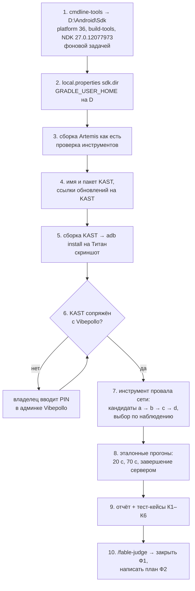

# План 03 — эпик 02, фаза Ф1: сборочный и измерительный стенд

> **Создан:** 2026-09-26 (агент, `/plan-epic` ступень 3) · **Родитель:** `plans/02_EPIC_reconnect.md` → «Ф1 — стенд»,
> исследование `researches/02_reconnect_epic_research.md` · **Статус:** ✅ 2026-09-26 — фаза Ф1 закрыта (судья: VERIFIED WITH CAVEATS, оговорки закрыты) · **Вовне:** —

Якорь в мета-плане: «Ф1 Стенд — SDK+NDK на D, APK KAST на Титане, инструмент провала сети, эталон «как было» + шаг 7
плана 01, набор тест-кейсов К1–К6».

## Вектор цели

- **Достичь:** агент сам собирает APK KAST на компьютере владельца, ставит его на планшет Titan 1 рядом с Artemis, стримит
  им рабочий стол с Vibepollo, умеет по команде устроить провал сети на заданное число секунд и снимает журналы клиента и
  сервера — эталон «как было» до правок.
- **Сохранить:** свободное место на диске C (SDK, NDK и кэш Gradle — на D); Artemis и Artemide на Титане не трогаются.

## Критерии приёмки

| # | Критерий | Шкала | Измеритель | Цель |
|---|---|---|---|---|
| 1 | Сборка проходит | код выхода | `gradlew.bat :app:assembleNonRoot_gameDebug` с `GRADLE_USER_HOME=D:\Android\gradle-home` | `0`, APK в `app/build/outputs/apk/` |
| 2 | Диск C не тратится на сборку | ГБ свободно на C | `Get-PSDrive C` до и после первой сборки | убыль ≤ 1 ГБ |
| 3 | У KAST своё имя и пакет | строки | `aapt2 dump badging <apk>` | `package: name='com.limelight.kastdebug'`, `application-label:'KAST Debug'` |
| 4 | KAST стоит рядом с Artemis | список пакетов | `adb shell pm list packages \| grep limelight` | `kastdebug`, `noir`, `perf` — все три |
| 5 | KAST стримит с Vibepollo | строки журнала сервера | `CLIENT CONNECTED` с адреса `100.99.111.48` после запуска KAST | есть; скриншот экрана Титана |
| 6 | Инструмент провала сети работает | поведение | провал 20 с на KAST без правок | в logcat конец соединения с кодом `-1` примерно через 10 с после начала провала — боль владельца воспроизведена по команде |
| 7 | Сервер держит молчащего клиента (план 01, шаг 7, критерий 3) | секунды | провал 70 с; от начала провала до конца сессии в журнале сервера — `Ping Timeout` (при таймауте Vibepollo пишет его, а не `CLIENT DISCONNECTED`; уточнено по находке F3 судьи) | 55–65 с |
| 8 | Завершение сервером не сломано (план 01, критерий 4) | секунды | выход из приложения на сервере → закрытие экрана KAST | ≤ 2 с |
| 9 | Эталон записан | файл | отчёт `testcases/reports/2026-09-26_F1_baseline.md`, семь полей (`kaif-testrun-lint`) | линтер зелёный |
| 10 | Тест-кейсы К1–К6 записаны до кода Ф2 | файл | `testcases/TC_reconnect.md` из шаблона KAIF | шесть кейсов со статусами и измерениями |

## Схема

## Шаги

- [x] 1. **SDK на D.** `commandlinetools-win-*_latest.zip` с `dl.google.com` → `D:\Android\Sdk\cmdline-tools\latest`;
      `sdkmanager --licenses`; `sdkmanager "platforms;android-36" "build-tools;36.0.0" "ndk;27.0.12077973"` — фоновой
      задачей. Проверка: папки `platforms\android-36` и `ndk\27.0.12077973` есть; замер свободного места на C до и после.
      ✅ 2026-09-26: в этом выпуске cmdline-tools (`16111833`) `sdkmanager` заменён на `android.exe sdk install
      platforms/android-36 ndk/27.0.12077973 build-tools/35.0.0` (EXP-0003); `android.exe sdk list` показывает все три;
      C: 18,76 → 18,81 ГБ (не тронут), D: −2,7 ГБ. Уточнение судьи (F7): сам Android CLI положил ~233 МБ в
      `C:\Users\krinik\.android\bin` и `cli` — в пределах критерия 2 (≤ 1 ГБ), но на C.
- [x] 2. **Окружение без глобальных изменений.** `local.properties` (в `.gitignore`) — `sdk.dir=D\:\\Android\\Sdk`;
      кэш Gradle — переменной окружения только на вызов: `$env:GRADLE_USER_HOME='D:\Android\gradle-home'`. Рецепт —
      строка в `HOUSE_RULES.md` → «Инструменты». Проверка: после сборки `C:\Users\krinik\.gradle` не появился.
      ✅ 2026-09-26: `C:\Users\krinik\.gradle` нет, кэш — 1,2 ГБ в `D:\Android\gradle-home`; `JAVA_HOME` машины указывает
      на несуществующий JDK 17 — сборка берёт `C:\Program Files\Microsoft\jdk-21.0.11.10-hotspot` (рецепт — `HOUSE_RULES.md`).
- [x] 3. **Сборка Artemis как есть** — `gradlew.bat :app:assembleNonRoot_gameDebug` (кусками по ≤ 10 мин, Gradle
      продолжает с места). Проверка: критерий 1. Это отделяет поломки инструментов от наших правок.
      ✅ 2026-09-26: `BUILD SUCCESSFUL in 2m 36s`, 4 APK по ABI; критерий 2 — C: 18,81 → 18,8 ГБ.
- [x] 4. **Имя и пакет KAST** — `app/build.gradle`: `applicationIdSuffix` `.kastdebug` / `.kast`, `app_label*`
      `KAST Debug` / `KAST` (и `(Root)`, `(Game)`); `obtainium_app_url` и ссылка `option_software_release`
      (`res/xml/preferences.xml:1019`) — на `github.com/MikalaiKryvusha/KAST`. Проверка: критерий 3.
      `FORK: options com.limelight.kast | io.github.mikalaikryvusha.kast · price of error: смена пакета потом = переустановка
      и новое сопряжение · consulted: просьба автора Moonlight в app/build.gradle («please change the applicationId»),
      практика форков — Artemis .noir и Artemide .perf оставляют com.limelight + суффикс; выбран суффикс — самый маленький
      дифф к Artemis (MASTER_PLAN, принципы)`.
      ✅ 2026-09-26: `aapt2 dump badging` — `com.limelight.kastdebug`, `KAST Debug`; двойник — подпись
      `summary_software_update` («Artemis Nior by ClassicOldSong») рядом с перенаправленной ссылкой переписана в 5 языках,
      где она есть (EN, RU, FR, zh-CN, zh-TW); ссылки на вики Artemis и на сервер Apollo оставлены — они верны для KAST.
- [x] 5. **Установка на Титан** — `adb install -r`; запуск; скриншот `adb exec-out screencap -p`. Проверка: критерий 4,
      снимок показан владельцу. ✅ 2026-09-26 12:39: `pm list packages` — `noir`, `perf`, `kastdebug`; KAST открылся на
      списке хостов («Поиск хост-ПК в вашей локальной сети…»).
- [x] 6. **Сопряжение KAST с Vibepollo** — в KAST добавить хост `100.80.125.66`; KAST покажет PIN; **владелец вводит PIN в
      админке Vibepollo** (`https://localhost:47990`, вход — его). Проверка: критерий 5.
      ✅ 2026-09-26: владелец вошёл в админку в отладочном Chrome, PIN ввёл агент через CDP (`D:\Android\tools\cdp.mjs`);
      права клиента «KAST Titan» — как у «Титан1 Artemide» по слову владельца; стрим — `CLIENT CONNECTED` 14:35:31.
- [x] 7. **Инструмент провала сети** — по наблюдению, по порядку цены (исследование 02, вывод 10):
      (a) правило брандмауэра Windows на хосте: блок входящего и исходящего для `sunshine.exe` и адреса Титана —
      не трогает `adb`; проверить, что правило рвёт уже идущий поток UDP;
      (b) `tailscale down` / `up` на хосте;
      (c) Wi-Fi Титана off/on с восстановлением на самом устройстве через `nohup`;
      (d) инструмент потери пакетов на хосте (WinDivert) — ставит драйвер, только если (a)–(c) не годятся.
      Выбранный — скрипт `tools/netdrop.ps1 -Seconds N -Remote <ip>` со снятием блокировки в `finally`; строка в
      `HOUSE_RULES.md`. Проверка: критерий 6.
      ✅ 2026-09-26: (a) НЕ годится — новое правило брандмауэра не рвёт уже идущий поток UDP (20 с «блока», в журнале
      сервера ни одной ошибки); (b) годится — `tools/netdrop.ps1` (`-Method tailscale` по умолчанию): боль владельца
      воспроизводится одной командой; (c), (d) не понадобились.
- [x] 8. **Эталонные прогоны** на KAST без правок: провал 20 с; провал 70 с (заодно шаг 7 плана 01, критерий 7); выход из
      приложения на сервере (критерий 8). Каждый — logcat Титана + журнал сервера + тип пути Tailscale (прямой / DERP).
      ✅ 2026-09-26: клиент сдаётся через 9,74 / 9,77 с (код −1); сервер держит 59,65 с (`Ping Timeout`); завершение
      сервером — ≈0,14 с (код 0); путь — DERP «fra»; часы Титана отстают на 1,064 с (учтено).
- [x] 9. **Отчёт и тест-кейсы** — `testcases/reports/2026-09-26_F1_baseline.md` (шаблон
      `.kaif/_testrun-report-template.md`), `testcases/TC_reconnect.md` (шаблон `.kaif/_testcases-template.md`) из
      К1–К6 мета-плана. Проверка: критерии 9–10. ✅ 2026-09-26: оба файла; `kaif-testrun-lint` — 0 находок; снимки
      экрана — только в приватной папке `D:\Android\private\evidence\` (на них рабочий стол владельца).
- [x] 10. **Закрытие фазы** — `/fable-judge`; статусы в мета-плане и `STATUS.md`; операционный план Ф2 — с уроками Ф1.
      ✅ 2026-09-26: судья в чистом контексте — **VERIFIED WITH CAVEATS**, все 10 критериев подтверждены его прогонами;
      находки закрыты: F5 — двойники подписей обновления (vi + `summary_follow_update` ×5) исправлены, поиск двойников —
      по КЛЮЧУ строки, не по тексту (EXP-0004); F9 — страж приватных имён: имена с учётом регистра и без ложных совпадений
      («максимальный», «maxim»), самопроверка 5/5 + 7/7, по дереву 0 совпадений; F8 — `netdrop.ps1`: восстановление
      Tailscale перед провалом, отказ без `DROP START`, код 1 если сеть не вернулась, чистый ASCII (прогон 3 с — зелёный);
      F6 — строка в `HOUSE_RULES.md`; F1/F2 — в отчёте дословный вывод инструмента, честные диапазоны и признание, что
      журнал клиента не сохранён; F3, F7 — строки плана уточнены; F4 — план 01, шаг 7 снят с галочки; F10 — K2 намеренно
      на Ф3. Уроки Ф1 для Ф2: каждый прогон сохраняет журнал клиента и срез журнала сервера (обёртка над `netdrop`).

## Что нужно от владельца

- Один раз ввести PIN сопряжения KAST в админке Vibepollo (шаг 6).
- Титан — на зарядке, беспроводная отладка включена, пока идут шаги 5–8.
- Для прогонов шага 8 стрим на Титане займёт сервер: сессию с Mac на это время лучше закрыть.

## Риски

- **Сборка на свежем NDK под Windows падает** (длинные пути, `ndk-build`) — вероятно; ответ: журнал сборки, поиск по
  известным ошибкам, три попытки → `/bug-research`.
- **Правило брандмауэра не рвёт уже идущий поток** — вероятно; ответ: кандидат (b).
- **Беспроводная отладка выключается при провале Wi-Fi** — касается только кандидата (c); ответ: не использовать его без
  владельца рядом.
- **Титан засыпает и `adb` отваливается** — `adb connect` заново; порт может смениться после перезагрузки (`HOUSE_RULES.md`).
- **Пути relay (DERP, ZeroTier RELAY) портят измерения** — у каждого прогона записывать тип пути.
- **Кэш Gradle и NDK на D занимают гигабайты** — на D свободно 37 ГБ; фактический размер замеряется после шага 3.
