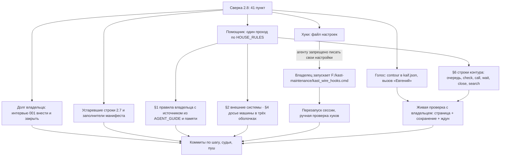

# План 05 — долг KAST по KAIF 2.8: хуки, голос, контур, дом-правила

> **Создан:** 2026-09-26 16:25 +03:00 (агент) · **Слово владельца:** «давай сделаем, что осталось, что 2.8 просит и у нас
> это пока долг - делаем. Интерактиыный контур, голос, и что там еще. Можешь субагентов поднять, чтобы помогали» и «давай
> все по порядку, но начнем с долга по хуку и голосу, чтобы меня звать, соседние проекты уже это делают и умеют» · чат
> 2026-09-26 · **Основа:** сверка KAST с KAIF 2.8 от 2026-09-26 16:01: 41 пункт; внедрено 16, частично 6, нет 16, не
> нужно сейчас 3 · **Статус:** 🔧 в работе

## Вектор цели

- **Достичь:** KAST живёт по KAIF 2.8, как соседние проекты владельца. Агент зовёт владельца голосом. Хуки
  останавливают агента, пока он не ответил на слово владельца посреди хода, и напоминают перечитать канон. Вопросы
  идут страницей, где ответ сохраняется кнопкой. Правила владельца записаны в `HOUSE_RULES.md` вместе с источником.
- **Сохранить:** работу над KAST (Ф2 удержания, баги); долг закрывается параллельно с ней.

## Схема

## Шаги

| # | Шаг | Кто | Проверка | Статус |
|---|---|---|---|---|
| 1 | Голос: `.kaif/kaif.json` → `contour` (обращение «Николай», проект «КАСТ», тихо 00:00–08:00), голос «Евгений» через `KAIF_VOICE_TOOL`; строка в HOUSE_RULES §6 | агент | настоящий вызов; владелец: «слышу четко» | ✅ 2026-09-26 ≈16:17 +03:00 (время на глаз), коммит `5c6bb510` |
| 2 | Хуки: готовый файл `F:\kast-maintenance\kast-hooks-settings.json` (= фрагмент KAIF) и скрипт `kast_wire_hooks.cmd` | агент → владелец | после запуска: `.claude/settings.json` есть; после перезапуска — ручная проверка по `.kaif/hooks/README.md` | ✅ 2026-09-26: владелец запустил скрипт и перезапустил сессию; вживую — хук-таймер прислал приказ перечитать канон, страж отклонил heredoc с `C:\probe\guard-test` и пропустил чистый |
| 3 | Интервью 001: ответ A внесён (своя копия ядра уже есть) — ссылки «интервью #001, Q1» в планах 02 и 04, строка «ждёт владельца» убрана из STATUS, таблица решений, `--mark-implemented`, статус ✅ | агент | `review.mjs --queue --list` без красной строки | ✅ 2026-09-26 16:29 +03:00, коммит `9bfd9cb0` |
| 4 | Устаревшие строки «2.7» в `STATUS.md` и `KAIF_FRAMEWORK.md`; заполнители `.kaif/deploy-manifest.json` (путь adb, команда сборки) | агент | чтение строк; `kaif-core.mjs check` зелёный | ✅ 2026-09-26: строки версии переписаны (`9bfd9cb0`); заполнители манифеста уже были исправлены при обновлении |
| 5 | HOUSE_RULES, один редактор: §1 — правила владельца из AGENT_GUIDE («KAST-specific») и из памяти агента (WebP, показ на Windows, прямой вопрос кончает ход…) с `[OWNER]`-источником, без правила про рабочий проект под NDA; §2 внешние системы; §4 досье машины (Git Bash, PowerShell 5.1, cmd по отдельности); §6 строки контура и линтера баг-репортов; шапка «перенесено из руководства»; в AGENT_GUIDE — одна строка-указатель | помощник | `kaif-attribution-lint check` = new 0; `kaif-core.mjs check` зелёный; страж приватных имён 0 | ⏳ |
| 6 | Голос текстов: `kaif-voice-lint load`, перепроверка текстов для владельца после 11:37 (`interview_001`, агентская часть `ideas/04`, `ideas/09`) с `--genre document` | агент | `check` без находок | ✅ 2026-09-26 16:25 портрет загружен; баг 04, план 05, идеи 04 и 09 — 0 находок. Интервью 001 не переписывалось: оно отвечено и хранит вопрос в том виде, в каком его видел владелец |
| 7 | EXP-0001 — пример из развёртывания: убрать | агент | `kaif-experience-lint check` OK | ✅ 2026-09-26 (`fde01a68`) |
| 8 | Живая проверка контура: при следующем настоящем вопросе — страница фоновой задачей, ждун `--wait`, владелец сохраняет ответ | агент + владелец | `interviews/decisions/<doc>.decision.json` и `shown.json` есть | ⏳ по первому вопросу |
| 9 | По первой нужде: форма C для тикета наружу (`kaif-testrun-lint bug`), страница-объяснение для поведения Ф2 | агент | линтер зелёный; страница открыта на Windows | ⏳ по нужде |

Параллельно: шаг 5 идёт у помощника, шаги 3, 4, 6, 7 — у агента; `HOUSE_RULES.md` и `AGENT_GUIDE.md` на это время правит
только помощник, `STATUS.md` и планы — только агент.
