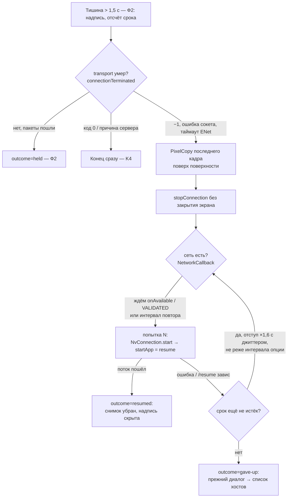

# План 06 — эпик 02, фаза Ф3: авто-возобновление — KAST сам поднимает поток, когда транспорт уже умер

> **Создан:** 2026-09-26 17:20 +03:00 (агент, `/plan-epic` ступень 3, при закрытии Ф2; владелец: «продолжай работы по
> КАСТ автономно два часа») · **Родитель:** `plans/02_EPIC_reconnect.md` → «Ф3 — авто-возобновление»; уроки Ф2 —
> `plans/04_epic02_F2_hold.md`, отчёт `testcases/reports/2026-09-26_F2_hold.md` · **Статус:** 🔧 код начат 2026-09-26 17:47 — шаг 6 готов,
> шаг 1 наполовину · **Вовне:** —

Якорь в мета-плане: «Ф3 — авто-возобновление. Ветка «транспортная смерть в пределах срока» в
`Game.connectionTerminated`; `ConnectivityManager.NetworkCallback`; `PixelCopy` до разборки декодера;
`stop → resume → start` на той же поверхности; один цикл повторов с отступом, ограниченный сроком; явная обработка
неудачного `/resume` (Vibepollo #443)».

## Вектор цели

- **Достичь (Achieve):** если связь с хостом по каналу ENet оборвалась (сменился адрес телефона при переходе Wi-Fi ↔ LTE
  без Tailscale; хост отпустил клиента раньше срока; смена сети убила сокеты), KAST остаётся на экране игры с последним
  кадром и надписью «Переподключаюсь… N с», сам делает `stop → resume → start` и продолжает поток, пока не истёк срок
  ожидания.
- **Сохранить (Maintain):** удержание Ф2 (провал короче срока, транспорт жив — ничего не пересоздаётся); завершение
  сервером (код 0) и выход пользователя — сразу, без повторов (K4).
- **Избежать (Avoid):** бесконечных повторов (срок — один на удержание и возобновление, отсчёт от начала тишины);
  нескольких вложенных циклов повторов (ENet + HTTP + внешний цикл); чёрного экрана вместо последнего кадра.

## Критерии приёмки

| # | Критерий | Шкала | Измеритель | Цель |
|---|---|---|---|---|
| 1 | K2: транспорт умер, сеть вернулась в срок | исход + секунды | отладочный таймаут ENet 10 с (шаг 6) + `droprun -Seconds 25`; журнал `KastReconnect` | `outcome=resumed attempt=N elapsed=`; картинка движется ≤ 10 с после возврата сети; диалога «Код ошибки: -1» нет |
| 2 | K3: сеть не вернулась в срок | секунды | ожидание 30 с, `droprun -Seconds 45` | диалог конца на 30–32 с после начала тишины, затем список хостов; `outcome=gave-up` |
| 3 | K4 не сломан | секунды | закрытие приложения сервером | ≤ 2 с, `connection terminated code=0`, повторов нет |
| 4 | K5, вторая половина: опция «Интервал повторных попыток» | наличие + действие | снимок настроек; `KastReconnect policy retry=` | есть, по умолчанию 3 с, 1–30 с, действует со следующего подключения |
| 5 | Последний кадр на время возобновления | снимок | `droprun -MidShotAt` во время попытки | на снимке кадр игры и надпись, не чёрный экран |
| 6 | Неудачный `/resume` (Vibepollo #443) | исход | журнал клиента и хоста | попытка засчитана неудачной, следующая — по расписанию; в срок — диалог, без зависания |
| 7 | K6: журнал | строки | `adb logcat -d -s KastReconnect` | на каждую попытку — `attempt=N reason=` и исход; сетевые события (`onAvailable`, `onLost`) |
| 8 | Контроль: опция решает | исход | интервал 30 с при провале 25 с | первая повторная попытка не раньше 30 с → K2 проходит позже или не проходит в срок, как посчитано |

## Схема

## Шаги

- [x] 1. **Классификатор исхода** (✅ 2026-09-26 18:13: FORK закрыт — код + «была ли тишина перед концом», таблица ниже; правила в `KastReconnectPolicy.endClass`, 7 JVM-тестов, мутант без учёта тишины краснеет; пока только журнал `end class= code= withinGrace=`, решение о возобновлении — шаг 4; ветка `transport` проверена на Титане, `final` — только тестом: сессия админки хоста истекла) — в `Game.connectionTerminated`: код 0 и причины сервера → конец сразу; −1, ошибки
      сокета и таймаут ENet в пределах срока → ветка возобновления. `FORK: options по коду завершения | по признаку
      «была тишина» | оба · price of error: повтор после настоящего завершения сервером держит пользователя на мёртвом
      экране · consulted: исследование 02, вывод 4 и A-2.3 (moonlight-common-c уже различает «сервер завершил» и «транспорт
      умер»)`.
      **Разведка кодов завершения** (2026-09-26 17:59 +03:00, исходники ядра `moonlight-common-c` @ `25ffe75`; решение — в
      следующей сессии). Откуда приходит код в `connectionTerminated`:
      | Код | Где рождается | Что значит | Класс для Ф3 |
      |---|---|---|---|
      | `0` | `ControlStream.c:1323`, `:1348` — сервер прислал причину «закрыто намеренно» после первого кадра | хост закрыл приложение | конец сразу |
      | `-1` | `ControlStream.c:1382` — ENet-событие DISCONNECT (в том числе таймаут пира), `:1180` — сервер не подтвердил разрыв за 1 с; `VideoStream.c:116`, `:132`, `AudioStream.c:265` — сбой приёма | транспорт умер | возобновление |
      | `LastSocketFail()` (errno, положительное) | `ControlStream.c:1202`, `:1415…1555`, `InputStream.c`, `VideoStream.c:143`, `AudioStream.c:273` — ошибка сокета, в том числе после смены сети | транспорт умер | возобновление |
      | `-100` `ML_ERROR_NO_VIDEO_TRAFFIC` | `VideoStream.c:153` — видео не пришло ни разу за несколько секунд после старта | порт UDP 47998 закрыт (`Limelight.h:416`) | конец сразу |
      | `-101` `ML_ERROR_NO_VIDEO_FRAME` | `VideoStream.c:175` — нет целого кадра несколько секунд | очень плохая сеть или слишком высокий битрейт (`Limelight.h:421`) | возобновление, если была тишина; иначе конец |
      | `-102`, `-103`, `-104` | `ControlStream.c:1328` и причины GFE 3.22+ | завершение на хосте: ранний выход, защищённый контент, ошибка преобразования кадра | конец сразу |
      | причина сервера «как есть» | `ControlStream.c:1352…1356` — неизвестная причина проходит без изменений; из короткого сообщения это 16-битное положительное число | хост закрыл по своей причине | конец сразу |
      Главная ловушка: причина сервера из короткого сообщения — положительное 16-битное число, ошибка сокета — тоже
      положительное число, по одному коду их не различить. Предлагается второй признак — была ли тишина канала управления перед
      завершением (сторож Ф2 знает это): причина сервера приходит при живом канале, ошибка сокета после смены сети — либо после
      тишины, либо вместе с событием сети `onLost` (шаг 3). `FORK:` закрыть в следующей сессии этой таблицей и прогоном K2.
- [ ] 2. **Последний кадр** — `PixelCopy` с `SurfaceView` до `stopConnection`, картинка в `ImageView` поверх поверхности на
      время попыток; `KEY_PUSH_BLANK_BUFFERS_ON_STOP` не ставить (исследование 02, вывод 6, A-5.3…5.5).
- [ ] 3. **Цикл попыток** — один: событие `ConnectivityManager.registerDefaultNetworkCallback` (`onAvailable` /
      `VALIDATED`) запускает попытку сразу; без события — отступ 1 с × 1,6 с джиттером ±20 %, не реже интервала опции;
      предел — срок ожидания от начала тишины; успех сбрасывает счётчик. `FORK: options экспонента с джиттером | фиксированный
      интервал | только по событию сети · price of error: шторм повторов на сервер или долгая пауза после возврата сети ·
      consulted: исследование 02, A-4.1 (gRPC 1 с × 1,6, джиттер), A-4.2 (AWS: без джиттера хуже всего), A-4.3 (SRE: никогда
      бесконечно), A-4.4 (SignalR: состояние «переподключаюсь», расписание по времени)`.
- [ ] 4. **Попытка** — `stop → resume → start` на той же поверхности: новый `NvConnection` с прежней конфигурацией;
      `startApp` сам выберет `resume` (сессия на хосте на паузе). Неудачный `/resume` (HTTP-ошибка или нет первого кадра за
      10 с) — попытка неудачна (Vibepollo #443, исследование 02, A-2.9).
- [ ] 5. **Опция** «Интервал повторных попыток» — `PreferenceConfiguration` + экран настроек рядом с «Временем ожидания»,
      1–30 с, по умолчанию 3 с; строки на всех переведённых языках, проверка по ключу (EXP-0004); заодно суффикс «с» с
      неразрывным пробелом («60 с», находка отчёта Ф2). `FORK: options 3 с | 5 с | 10 с по умолчанию · price of error: долгая
      пауза после возврата сети или лишняя нагрузка на хост · consulted: A-4.4 (SignalR 0/2/10/30 с), A-4.1 (старт 1 с)`.
- [x] 6. **Инструмент для K2** (✅ 2026-09-26 17:47, отчёт `testcases/reports/2026-09-26_F3_instrument.md`: скрытый ключ `kast_debug_enet_timeout_seconds` без экрана настроек, пишется через `run-as` как `<int …/>`, действует только меньше срока ожидания; 10 при ожидании 60 с → `policy grace=60000 enet=10000`, провал 20 с оборвал транспорт на 10,11 с, `end class=transport withinGrace=true`) — отладочная настройка только в debug-сборке: «таймаут ENet клиента, с» (по умолчанию =
      сроку ожидания). С ней транспорт умирает на 10-й секунде при сроке 60 с, и путь возобновления проверяется на живом хосте
      владельца без правки его сервера.
- [ ] 7. **Журнал** — `KastReconnect`: `attempt=N reason=<network|backoff> ...`, `outcome=resumed|gave-up elapsed=`, события
      сети; строка политики с интервалом.
- [ ] 8. **Прогоны** — K2, K3, K4, K5, K6, критерии 5, 6, 8; отчёт `testcases/reports/<дата>_F3_resume.md`; статусы в
      `testcases/TC_reconnect.md`; снимки надписи и кадра — владельцу на Windows.
- [ ] 9. **Закрытие** — `/fable-judge`; статусы; план Ф4 (полевая проверка).

## Риски

- **Сервер держит старую сессию на паузе и не отдаёт её** (Vibepollo #443) — вероятно на длинных провалах; ответ: попытка
  засчитывается неудачной по таймауту первого кадра, срок ограничивает всё; после срока — прежний диалог и ручной выход
  из сессии в списке приложений.
- **Два потока одновременно**: старый `NvConnection` не до конца остановлен, новый уже стартует — ответ: `stopConnection`
  ждёт завершения, попытка идёт только после него; журнал показывает порядок.
- **Смена сети без Tailscale меняет адрес хоста для клиента** — у владельца Tailscale, адрес `100.x` не меняется; без
  Tailscale адрес берётся заново из базы компьютеров (`ComputerManagerService`) — проверить в Ф4 на LTE.
- **Ввод, накопленный за время тишины** (риск Ф2 остаётся): на время попыток ввод не отправляется — старое соединение
  закрыто, новое ещё не поднято.
- **Канал ~5 Мбит/с до Титана** — установка APK 75–85 с; прогоны пачкой.
