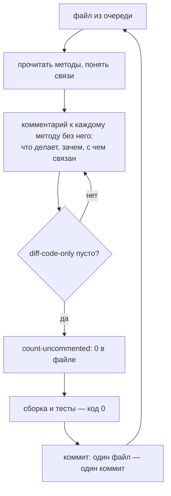

# План 07 — комментарии к коду, доставшемуся от Artemis

> **Создан:** 2026-09-26 (агент; обязательство владельца — `AGENT_GUIDE.md` → Code style) · **Родитель:** слова владельца,
> чат 2026-09-26 19:21: «даже сырой код, который нам от Артемис достался - нужно комментировать - запиши это в АГЕНТ ГАЙД -
> это наше обязательство по развитию KAST» · **Статус:** 📝 план; точка отсчёта 2026-09-26 20:39 — 119 методов из 1900 с
> комментарием (6,3 %) · **Вовне:** —

## Вектор цели

- **Достичь:** у каждого метода Java-кода приложения есть комментарий: что метод делает, зачем и с чем связан.
- **Сохранить:** поведение KAST — комментирование не меняет ни одного символа кода.
- **Избежать:** дифф к Artemis без пользы: комментарий объясняет, а не пересказывает строку под собой.

## Критерии приёмки

| # | Критерий | Шкала | Измеритель | Цель |
|---|---|---|---|---|
| 1 | Доля методов с комментарием | методы | `node tools/count-uncommented.mjs --total` | 100 % в файлах, закрытых планом; итог по всему коду — растёт с каждым файлом |
| 2 | Код не изменился | символы кода | `node tools/diff-code-only.mjs <файл>` (шаг 1): тексты до и после без комментариев и пробелов совпадают | пусто для каждого файла прохода |
| 3 | Сборка и тесты | код выхода | `gradlew.bat :app:assembleNonRoot_gameDebug` и `:app:testNonRoot_gameDebugUnitTest` | 0 |

## Схема

## Шаги

- [ ] 1. **Инструмент «код не изменился»** — `tools/diff-code-only.mjs <файл> [ревизия]`: снимает комментарии и пробелы с версии
      файла в ревизии (по умолчанию `HEAD`) и с рабочей копии и сравнивает; код выхода 1 при любом отличии. Проверка на сломанной
      версии: рабочая копия с изменённым оператором — красная.
- [ ] 2. **Очередь — от файлов, которые трогает Ф3, к остальным**, по числу методов без комментария (точка отсчёта 20:39):
      `Game.java` 155, `ControllerHandler.java` 63, `NvHTTP.java` 53, `MediaCodecDecoderRenderer.java` 51, `NvConnection.java`,
      затем по таблице `node tools/count-uncommented.mjs` сверху вниз (`PcView.java` 51, `ComputerManagerService.java` 45,
      `StreamConfiguration.java` 44 …).
- [ ] 3. **Проход по файлу** — по схеме выше; комментарий пишется по-английски (его читают модели и будущие сессии), наш код
      отличается пометкой `KAST (<план или баг>)`, объяснение унаследованного кода её не несёт.
- [ ] 4. **Связка с задачами:** задача, которая читает или меняет непрокомментированный блок, комментирует его тем же коммитом
      (правило `AGENT_GUIDE.md`); проход плана 07 идёт между задачами и не смешивается с изменениями поведения.
- [ ] 5. **JNI и ядро** — `moonlight-core/*.c` после Java-кода; ядро `moonlight-common-c` — в нашей копии, отдельным планом.

## Риски

- **Дифф к Artemis растёт** — вливать свежие версии Artemis станет труднее (`MASTER_PLAN.md` → «Маленький дифф к Artemis»);
  цена принята словом владельца. Смягчение: один файл — один коммит, код не меняется — конфликт при вливании только в строках
  комментариев.
- **Комментарий, который врёт.** Проверка — чтение кода, не догадка; где связь не ясна, комментарий говорит, чего код ждёт,
  без выдумки.
