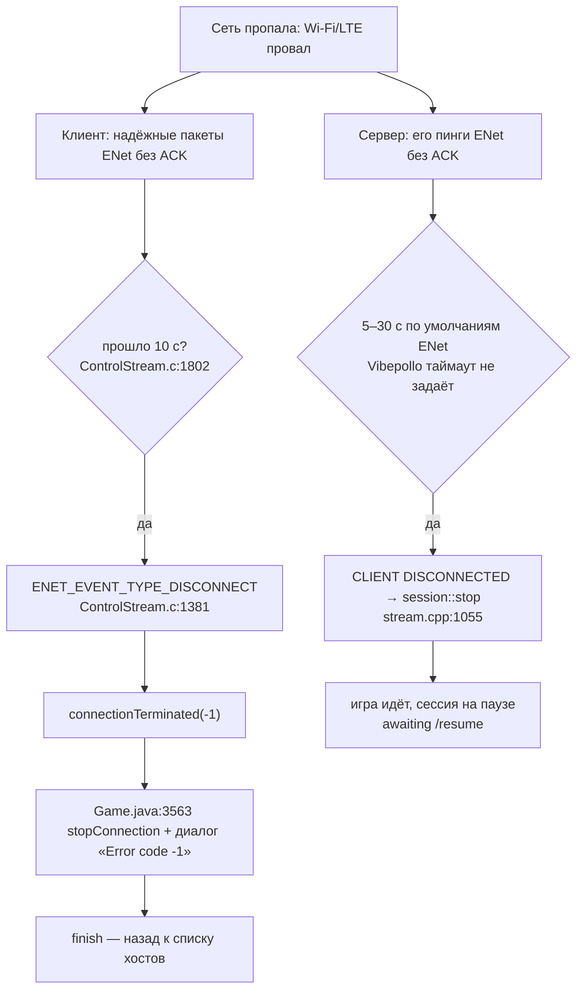

# Исследование 01 — почему Artemis рвёт сессию при временной потере сети

> **Создан:** 2026-09-26 (агент Claude Opus 5.5, по постановке владельца — `ideas/01_reconnect_grace_period.md`)
> · **Родитель:** `ideas/01_reconnect_grace_period.md` · **Статус:** живой справочник; причины найдены и
> подтверждены кодом и журналом сервера 2026-09-26; сторона клиента (logcat при воспроизведении) — ещё не
> снята · **Вовне:** запрос автору Vibepollo отправлен 2026-09-26 — https://github.com/Nonary/Vibepollo/issues/522

Снимки кода, по которым сделан разбор: Artemis `c5cf27f4` (2026-09-09), его `moonlight-common-c` —
`ClassicOldSong/moonlight-common-c` `c999436` (2025-09-01), Vibepollo `1.19.0-beta.3` коммит `a502576d`
(та версия, что стоит у владельца). Artemide (`derflacco/moonlight-android`) в этих местах **идентичен**
Artemis — `connectionTerminated` в `Game.java` и весь `moonlight-common-c/src` совпадают побайтно.

## Короткий ответ

Сессию рвёт **не сервер и не `ping_timeout`, а управляющий канал ENet с обеих сторон**:

1. **Клиент** ждёт подтверждений от сервера **10 секунд** (`ControlStream.c:1802`,
   `enet_peer_timeout(peer, 2, 10000, 10000)`), затем ENet сам объявляет пира мёртвым →
   `ENET_EVENT_TYPE_DISCONNECT` → «Control stream received unexpected disconnect event» →
   `connectionTerminated(-1)` (`ControlStream.c:1381–1382`) — это и есть **«Error code -1»**.
2. **`Game.connectionTerminated`** (`Game.java:3563`) на любой код, кроме 0, делает `stopConnection()`,
   показывает диалог и закрывает Activity → пользователь на списке хостов. **Механизма переподключения в
   клиенте нет вообще** (`grep -i reconnect` по `app/src/main/java` — пусто).
3. **Сервер Vibepollo** своего таймаута ENet-пира **не задаёт** (`enet_peer_timeout` в `src/stream.cpp` нет) —
   работают умолчания ENet: `LIMIT 32 · MINIMUM 5000 мс · MAXIMUM 30000 мс` (`enet.h:229–232`), то есть
   сервер сам отпускает клиента где-то **между 5 и 30 с** тишины. На `CLIENT DISCONNECTED` он зовёт
   `session::stop` (`stream.cpp:1055–1059`). `ping_timeout=60000` в `sunshine.conf` охраняет только пинги
   видео/аудио (`stream.cpp:1671` «Ping Timeout») и до этой ветки дело не доходит.

Следствие для решения: **одним «ждать дольше» на клиенте 60 секунд не пережить** — сервер отпустит раньше.
Нужны два слоя: *удержание* (пережить короткий провал без разрыва) и *авто-возобновление* (`/resume` внутри
того же экрана игры, когда транспорт всё-таки умер). Vibepollo к этому готов: после отключения клиента игра
продолжает идти, сессия стоит на паузе — в журнале «keeping watchdog alive while session is paused (awaiting
/resume)».

## Карта мест: где временная потеря сети превращается в конец сессии

Пути — от корня `app/src/main/jni/moonlight-core/moonlight-common-c/src/` для C и `app/src/main/java/com/limelight/` для Java.

| Место | Что срабатывает | Код ошибки | Когда при потере сети |
|---|---|---|---|
| `ControlStream.c:1802` | таймаут ENet-пира 10 с (3DS — 60 с, `:1799`) | — (причина) | **главный спусковой крючок** |
| `ControlStream.c:1381–1382` | `ENET_EVENT_TYPE_DISCONNECT` | `-1` | через 10 с тишины |
| `ControlStream.c:1197–1202` | `serviceEnetHost` < 0 (ошибка сокета) | `LastSocketFail()` | только нетранзиентные ошибки: ENet уже прощает `EWOULDBLOCK`, `EADDRNOTAVAIL`, `ENETDOWN`, `ENETUNREACH`, `EHOSTDOWN`, `EHOSTUNREACH` (`enet/unix.c:660–676`) |
| `ControlStream.c:1175–1180` | тайм-аут ожидания disconnect после уведомления сервера | `-1` | при штатном завершении сервером, не при провале сети |
| `ControlStream.c:1411–1415`, `:1434–1437`, `:1474–1478` | отправка статистики потерь / периодического пинга (каждые 100 мс) не удалась | `LastSocketFail()` | после смерти пира (`enet_peer_send` не в CONNECTED) — вторичное |
| `ControlStream.c:1514–1517`, `:1527–1530`, `:1552–1555` | запрос IDR / инвалидации опорных кадров не ушёл | `LastSocketFail()` | вторичное, после смерти пира |
| `InputStream.c:246–249`, `:261–264`, `:275–278`, `:297–300` | отправка ввода не удалась | `err` / `LastSocketFail()` | вторичное, после смерти пира |
| `VideoStream.c:141–143` | `recvUdpSocket` < 0 | `LastSocketFail()` | ошибки кроме таймаута и `ECONNREFUSED` (ICMP port unreachable прощается, `PlatformSockets.c:222–228`) |
| `VideoStream.c:147–153` | нет ни одного видеопакета 10 с | `ML_ERROR_NO_VIDEO_TRAFFIC` (-100) | **только до первого пакета** — важно для фазы переподключения |
| `VideoStream.c:168–175` | нет целого кадра 10 с после первого пакета | `ML_ERROR_NO_VIDEO_FRAME` (-101) | только до первого целого кадра |
| `AudioStream.c:271–273` | `recvUdpSocket` < 0 | `LastSocketFail()` | как у видео |
| `ControlStream.c:1310–1373` | сервер прислал пакет завершения | `0` / -102 / -103 / -104 | **настоящее завершение сервером — трогать нельзя** |
| `Connection.c:158–181` | `ClInternalConnectionTerminated` — один вызов на соединение, в отдельном потоке | — | воронка: все пути выше сходятся сюда |
| `Game.java:3563–3645` | `connectionTerminated` → `stopConnection()` → диалог → `finish()` | — | любой код ≠ 0 |
| `Game.java:3647` | `connectionStatusUpdate` — только надпись «плохое соединение» | — | не рвёт |
| `Game.java:540` | `ConnectivityManager` используется лишь для предупреждения о лимитной сети | — | слушателя смены сети нет |

После первого кадра **тишина видео/аудио сама по себе сессию не рвёт** — рвёт только ENet.

## Доказательство из журнала сервера (вечер 2026-09-25)

`C:\Program Files\Apollo\config\logs\sunshine-20260925-184220-042.log`, `ping_timeout = 60000` уже действовал:

- с 21:12 до 22:03 — **8 отключений `CLIENT DISCONNECTED`**, и **ни одного «Ping Timeout»**.
- перед отключением в 21:57:41 сервер 13 секунд (21:57:28 → 21:57:40, 13 строк) писал `Couldn't receive
  data from udp socket: …` с текстом в битой кодировке. По длинам слов это системное сообщение Windows
  10061 «Подключение не установлено, т.к. конечный компьютер отверг запрос на подключение» — то есть
  телефон был **достижим**, но его порт уже **закрыт**: клиент **сдался первым** и закрыл сокеты, а сервер
  ещё держал сессию. (В чате 2026-09-26 агент назвал это `WSAECONNRESET` — поправка: по тексту это 10061;
  вывод «клиент закрыл порт» от этого не меняется.)
- клиент — «Титан1 Artemide», адреса Tailscale `100.x` (`100.99.111.48`, `100.89.194.62`, `100.80.125.66`).

Логов клиента (logcat) при воспроизведении ещё нет — это первое, что стоит снять, прежде чем чинить.

## Транспорт: почему через Tailscale удержание возможно, а без него — нет

Все UDP-сокеты клиента привязаны к локальному адресу, с которого шёл RTSP (`LocalAddr`):
видео `VideoStream.c:333`, аудио `AudioStream.c:96`, ENet `ControlStream.c:1724`. Если IP телефона меняется
(Wi-Fi → LTE, новый DHCP), старые сокеты мертвы навсегда — поможет только новое соединение (`/resume`).
Через Tailscale адрес телефона `100.x` **не меняется** при смене физической сети — старые сокеты оживают,
когда сеть вернулась, и короткий провал можно пережить удержанием.

## Направления решения (гипотезы для плана, не план)

1. **Удержание** (короткие провалы, пока сервер ещё держит пира): таймаут ENet на клиенте — из настройки
   «reconnect grace period» (по умолчанию 60 с) вместо жёстких 10 с; пока идёт провал — последний кадр на
   экране, поверх — «Связь потеряна, восстанавливаю… N с»; ввод не копится.
2. **Авто-возобновление** (сервер уже отпустил, IP сменился, ENet умер): вместо `finish()` — остаться в
   `Game`, заморозить последний кадр (снимок `PixelCopy` поверх `SurfaceView`, чтобы не зависеть от
   поведения декодера при `release`), дождаться сети (`ConnectivityManager.NetworkCallback`), затем
   `LiStopConnection` → `/resume` → `LiStartConnection` на той же поверхности; повторять с отступом до конца
   grace period; лишь потом — старый диалог.
3. **Не ухудшать** настоящее завершение: пакет завершения от сервера (`ControlStream.c:1310–1373`, код 0 и
   -102…-104), выход пользователя, `quitOnStop` — как сейчас, без ожидания.
4. **Логи**: одна строка на каждое решение — причина (путь из таблицы выше, код, errno), время тишины,
   состояние сети Android, номер попытки, итог.
5. **Сервер** (не наш код, решение владельца): <!-- attribution-ok: names who will decide; no decision of the owner is claimed --> маленький PR в Vibepollo — настраиваемый таймаут ENet-пира
   (как клиентский) — сделал бы удержание на 60 с возможным и без переподключения.

## Выбор базы форка (2026-09-26)

| Кандидат | Звёзды | Последний push | Коммитов за 3 мес. | Замечание |
|---|---|---|---|---|
| `ClassicOldSong/moonlight-android` (**Artemis**) | 4057 | 2026-09-09 | 4 | +555 своих коммитов поверх Moonlight (функции для Apollo), −55 от свежего Moonlight — **выбран** |
| `moonlight-stream/moonlight-android` (Moonlight) | 7166 | 2026-09-12 | 32 | сентябрьская волна обслуживания (12.2, NDK r29, API 36, геймпады) — её можно влить в KAST |
| `derflacco/moonlight-android` (**Artemide**) | 252 | 2026-08-30 | 0 | +31 оптимизация производительности, −76 от Artemis |
| `Nonary/moonlight-android` (автор Vibepollo) | 2 | 2022-07-12 | 0 | заброшен; Moonlight 10.6 |

`Nonary/moonlight-common-c` = upstream (ahead 0); `ClassicOldSong/moonlight-common-c` — ahead 6 / behind 42.

## Источники

- Код: Artemis `c5cf27f4`, `moonlight-common-c` `c999436`, `enet` (cgutman) — в этом репозитории.
- Vibepollo `src/stream.cpp` @ `a502576d` — https://github.com/Nonary/Vibepollo
- Журнал Vibepollo владельца — `C:\Program Files\Apollo\config\logs\` (не в репозитории).
- https://github.com/Nonary/Vibepollo/discussions/70 — сообщество советует Artemis как клиент.
- https://github.com/Nonary/Vibepollo/issues/326 — `WSAECONNRESET` после отключения клиента (открыт).
